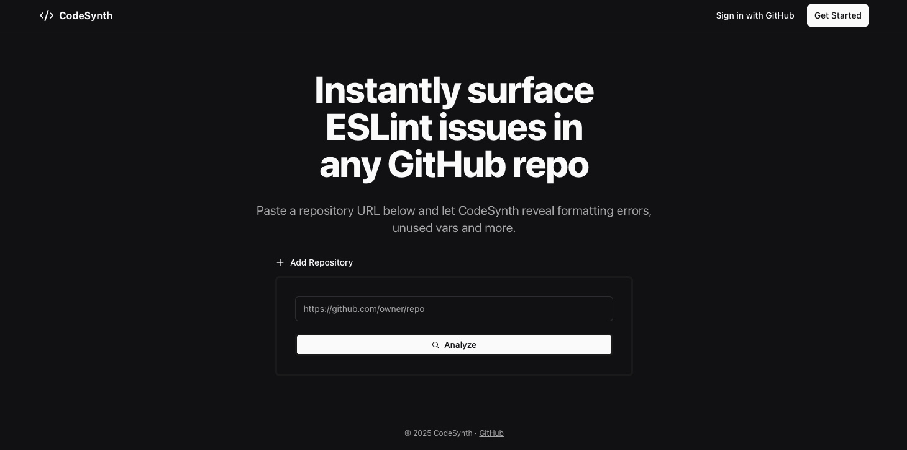
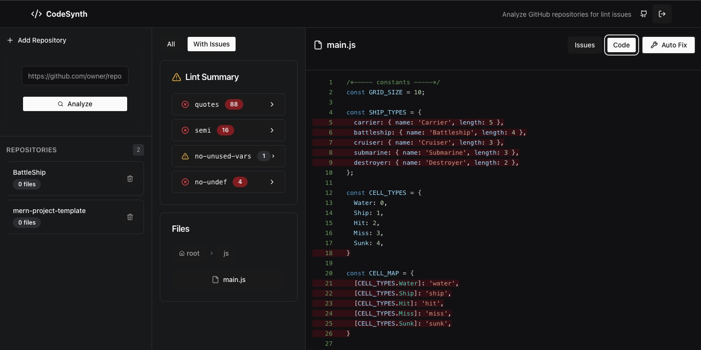

# CodeSynth



## Description

**CodeSynth** is a Git-Hub–integrated code-quality dashboard that lets developers instantly lint any public repository without cloning it locally. Authenticate with GitHub, pick a repository, and receive a grouped summary of ESLint issues, per-file details, and quick-fix suggestions. CodeSynth was built to give engineering students and professionals a friction-free way to gauge code health and learn best practices.



---
## Features

* **GitHub OAuth** – one-click sign-in with GitHub.
* **Repository Analyzer** – fetches repo contents through the GitHub API and performs in-memory ESLint analysis.
* **Persistent Dashboard** – save, revisit, or delete analyzed repositories (full CRUD).
* **File Tree & Preview** – navigate directories, view file contents, and see inline lint messages.
* **JWT-secured API** – stateless communication between React front-end and Express back-end.
* **Responsive UI** – Tailwind CSS + shadcn/ui ensure a cohesive theme on any screen size.
* **Deployed on Heroku** – live demo available 24 × 7.

---
## Getting Started

### Live Application
Check out CodeSynth! → **https://codesynth-b0400ce4d819.herokuapp.com**

### Planning Materials
All user stories, ERD, and wireframes are tracked on our [Trello Board](https://trello.com/b/nN0c4lYN/codesynth)

### Repositories
* **Front-End & Back-End (monorepo)** – <https://github.com/Mikebrown0409/CodeSynth>

### Local Development

```bash
# Clone the repo
$ git clone https://github.com/Mikebrown0409/CodeSynth.git
$ cd CodeSynth

# Install server deps
$ npm install

# Install front-end deps
$ cd frontend && npm install && cd ..

# Copy environment templates and fill in your secrets
$ cp .env.example .env           # backend
$ cd frontend && cp .env.example .env && cd ..

# Start dev servers concurrently (backend :3000, Vite :5173)
$ npm run dev
```

---
## Technologies Used

| Layer | Tech |
|-------|------|
| **Front-End** | React (Vite), React Router v6, TailwindCSS, shadcn/ui, Lucide Icons |
| **Back-End** | Node.js, Express, Mongoose, Octokit REST, ESLint, JSON Web Tokens |
| **Database** | MongoDB Atlas |
| **Auth** | GitHub OAuth (Authorization Code) + express-session (state) + JWT |
| **Dev Ops** | ESLint, Prettier, GitGuardian secret scanning |
| **Deployment** | Heroku |

---
## Next Steps

1. **Commit Auto-Fixes** – push ESLint `--fix` patches directly to GitHub via PR.
2. **Notes / Comments** – allow users to include notes/comments to attach to review.
3. **AI Integration** – integrate with an AI model to review code issues that aren't resolved and provide feedback to user on commit.
4. **Rules Flexibility** – add a rules option to allow users to select and choose rules. 
5. **Search Bar** – quickly jump to files or error types.
6. **Additional Formatters - Security Tools** - add prettier and potentially other security audits that will assist in catching issues sooner rather than later.


---
## Attributions

* **shadcn/ui** – React component library (<https://ui.shadcn.com>)
* **Lucide Icons** – MIT-licensed icon set (<https://lucide.dev>)
* **Octokit** – GitHub REST client (<https://github.com/octokit>)
* **RealFaviconGenerator.net** – favicon bundle
* **GitGuardian** – secret-leak monitoring

---
## License

Released under the MIT License. See [LICENSE](LICENSE) for details. 